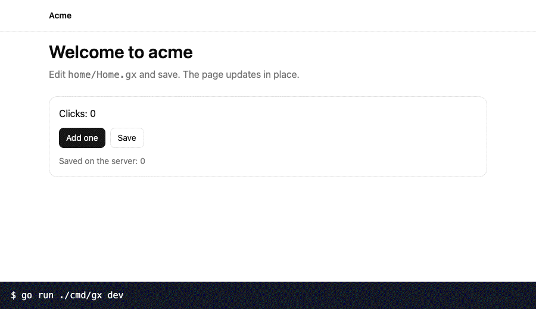

# Gx

Gx is a Go framework for server-rendered web apps. It types the full loop of a page: the template, the route, the link, the action, the form and the signal in the browser. It runs on `net/http` and Datastar, and no default workflow needs node.

**Status: version 0.3.0 is the current release.** The API of a 0.x release can change. Read the [docs](https://gx-docs.pages.dev) and the [comparisons](https://gx-docs.pages.dev/compare/comparisons/) before you choose Gx.

## Quick start

You need Go 1.25 or later.

```sh
go install github.com/alternayte/gx/cmd/gx@latest
gx init acme
cd acme && go run ./cmd/gx dev
```

Open `http://127.0.0.1:3333`.

## The dev loop



`gx dev` is one command. Save a file, and the page updates in place. The signals, the input values and the scroll position stay.

## One typed loop

This is a cart with a count in the browser and a total from the server. Each part is typed: the props, the signal, the action input and the fragment that the action patches.

The route package holds the input of the action. `Qty` reads the signal of the cart that invokes the action. The rules check it, because the browser controls a signal.

```go title="cart/route/route.go"
// Package route holds the route types of the cart slice.
package route

import "github.com/alternayte/gx"

// Add puts items in the cart. Qty comes from the Qty signal of the cart.
type Add struct {
	gx.Route `POST /cart/add`
	Qty      int `signal:"qty"`
}

// Rules checks the amount.
func (in *Add) Rules() gx.Rules {
	return gx.Rules{gx.Field(&in.Qty, gx.Min(1), gx.Max(99))}
}
```

The component is HTML with Go expressions. `$Qty` is the signal, `on:click` invokes the action with a struct value, and `#total` marks the fragment.

```gx title="cart/Cart.gx"
package cart

import "acme/cart/route"

props {
  // Price is the price of one item.
  Price int
}

signals {
  // Qty is the amount in the number field.
  Qty int = 1
}

<section class="rounded-xl border border-border p-4">
  total := p.Price
  <p>Price: {p.Price} EUR</p>
  <input type="number" min="1" bind:value={$Qty} class="mt-2 w-20 rounded-md border border-border px-2 py-1" />
  <p show={$Qty > 10} class="text-sm text-destructive">A large order needs more time.</p>
  <button class="mt-2 rounded-md bg-primary px-3 py-1.5 text-sm text-primary-foreground" on:click={route.Add{}}>Add to cart</button>
  <p class="mt-2">Total: <strong #total(total int)>{total}</strong> EUR</p>
</section>
```

The handler answers with a patch. `CartTotal` is the function that Gx generates for the fragment.

```go title="cart/cart.go"
// Package cart is the cart slice.
package cart

import (
	"github.com/alternayte/gx"
	"acme/cart/route"
)

// price is the price of one item in the example.
const price = 4

// Add patches the total of the cart that invoked it.
var Add = gx.Action(func(c *gx.Ctx, in route.Add) error {
	key := gx.ScopeKey(gx.Scope(c.R), "cart.Cart")
	return c.Patch(CartTotal(key, in.Qty*price))
})

// Routes lists the actions of the slice.
var Routes = gx.Collect(Add)
```

Rename `Qty`, the route or the fragment, and the build stops at each place that uses it. Nothing here is a string that only fails in the browser.

## What you get

- **Typed templates.** A `.gx` file is one component with named props.
- **Typed routes, links, actions and forms.** A route is a Go struct. A form has one rule set for the browser and the server.
- **A dev loop.** Rebuild, restart, page morph and an error overlay, in one command.
- **A component registry.** `gx add` copies a component into the app. `gx update` merges a later release with your changes.
- **Content sites.** Markdown collections with typed frontmatter, components, search and a static export.
- **Tools.** A language server, a formatter, a linter, the app model as JSON and a dev MCP server.
- **Islands.** A TypeScript file is a component with typed props from Go.
- **Widgets.** A component of your app is a custom element on a page of a different site. Your server renders it.
- **Tools for agents.** An action with `.Tool()` is a tool that the agent of a user calls, in the browser and over MCP.
- **Plugins.** A typed Go value adds directives, commands and build steps to the `gx` command of a project.
- **One binary.** `gx build` puts the pages, the scripts and the stylesheet in one file.

## This repository

| Path | Content |
| --- | --- |
| `*.go` in the root | Package `gx`: the public API. |
| `cmd/gx`, `gxcli` | The command line tool. |
| `internal/compiler` | The `.gx` compiler, the checks and the code generator. |
| `runtime/js` | The browser runtime, in TypeScript. |
| `registry` | The component registry. |
| `docs` | The docs site. It is a Gx app. |
| `examples/shop`, `examples/deedbox-docs` | The example apps. |
| `tests/e2e` | The browser tests of this repository. |

## Build and test

```sh
go build ./...
just verify
```

`just verify` is the gate: build, vet, each Go test, the scripts in `checks/` and the browser tests. It needs Go, Bun and Chrome. It needs the network for the first Tailwind and Pagefind downloads. An app that uses Gx needs only Go.

## Licence

MIT.
